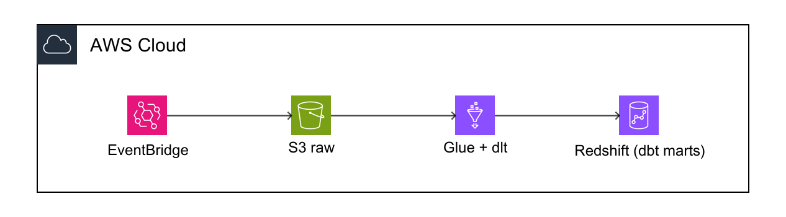
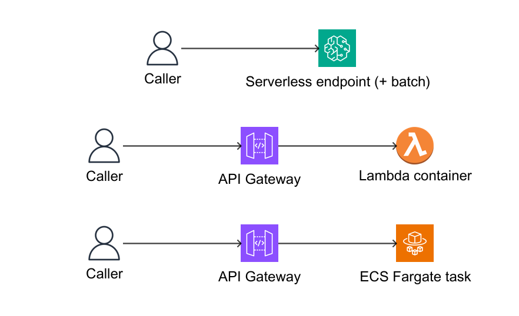
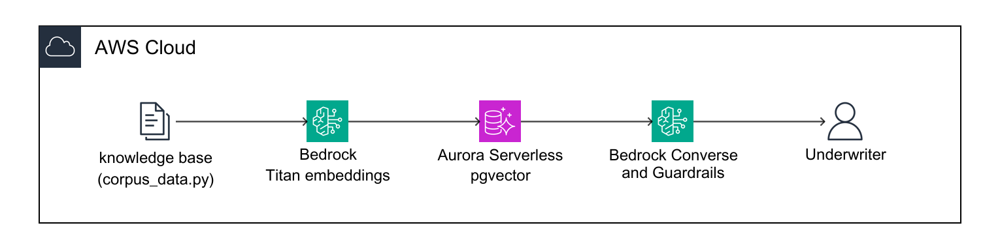
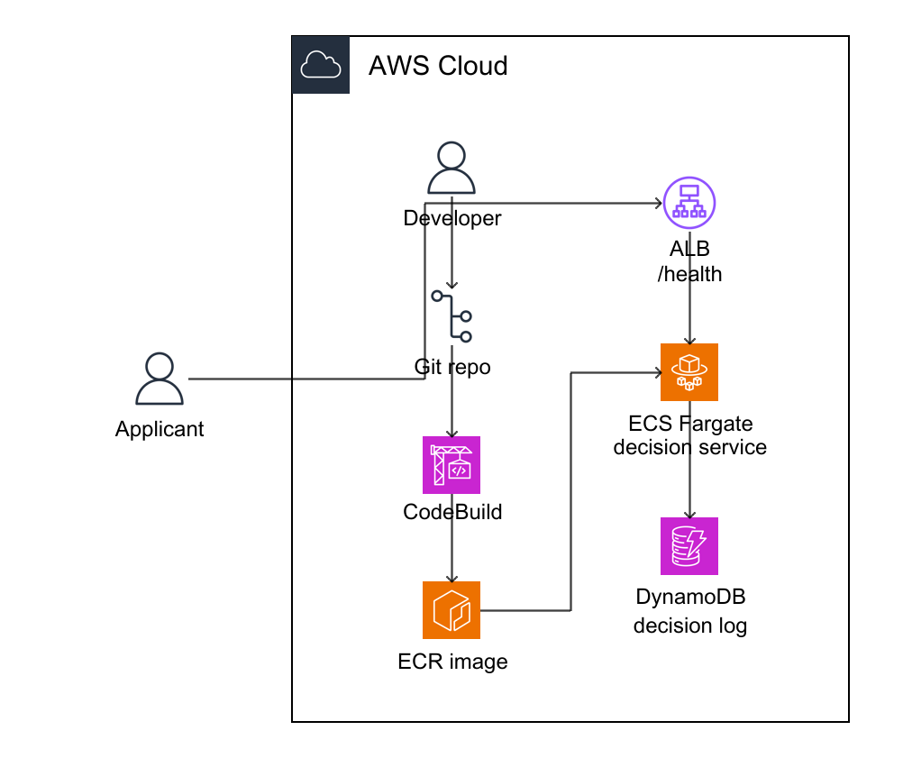
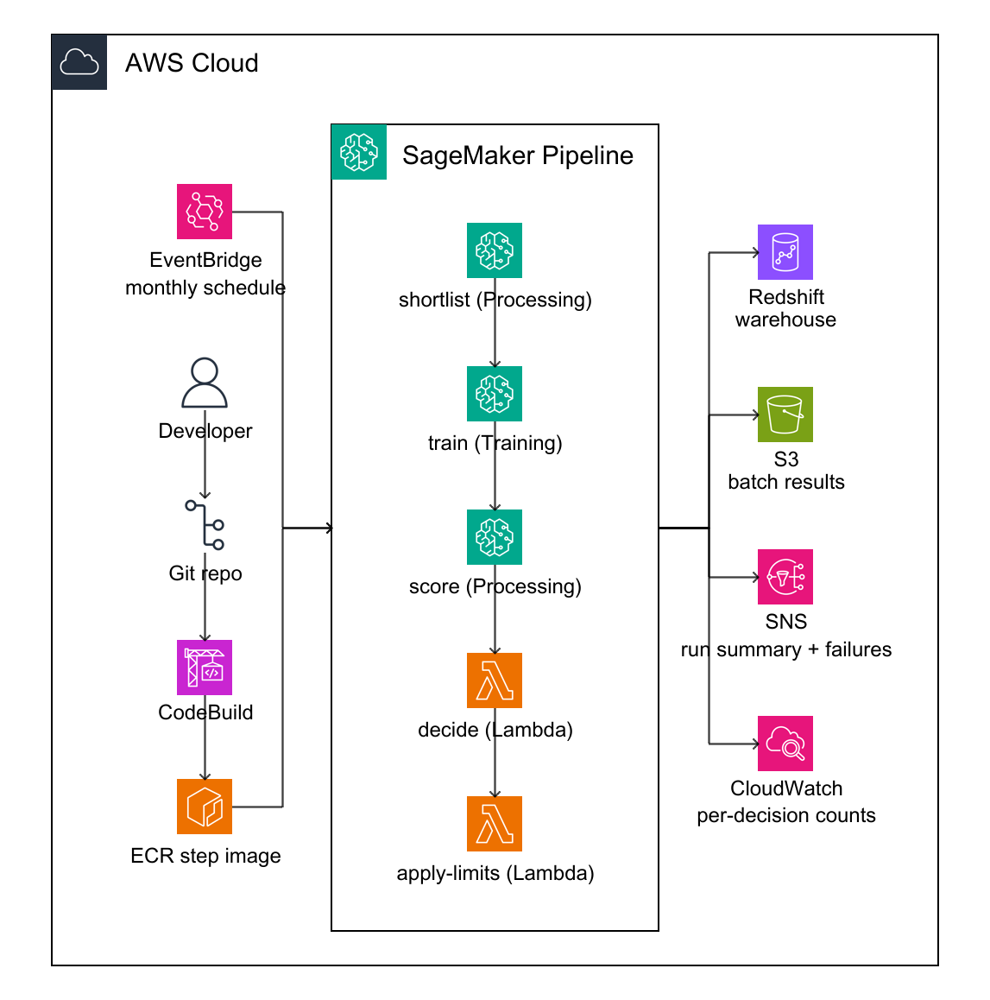
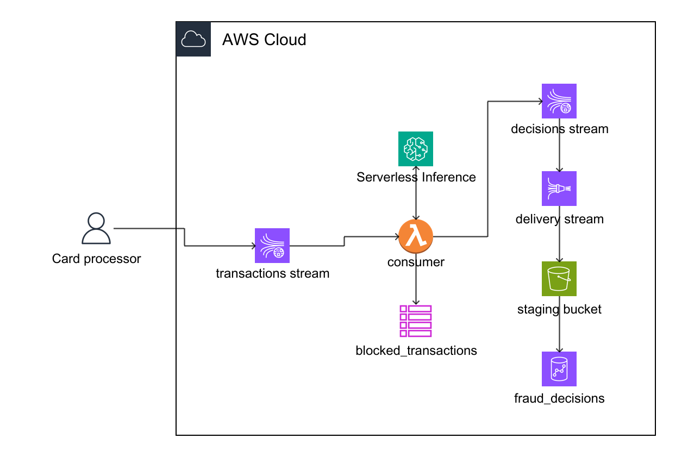
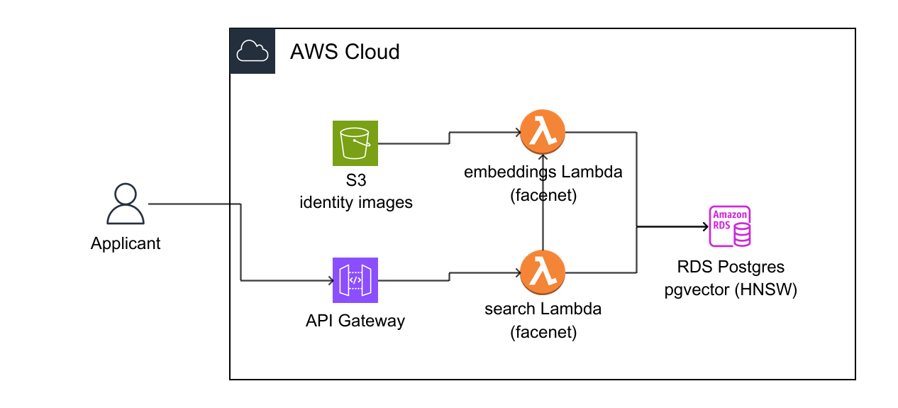
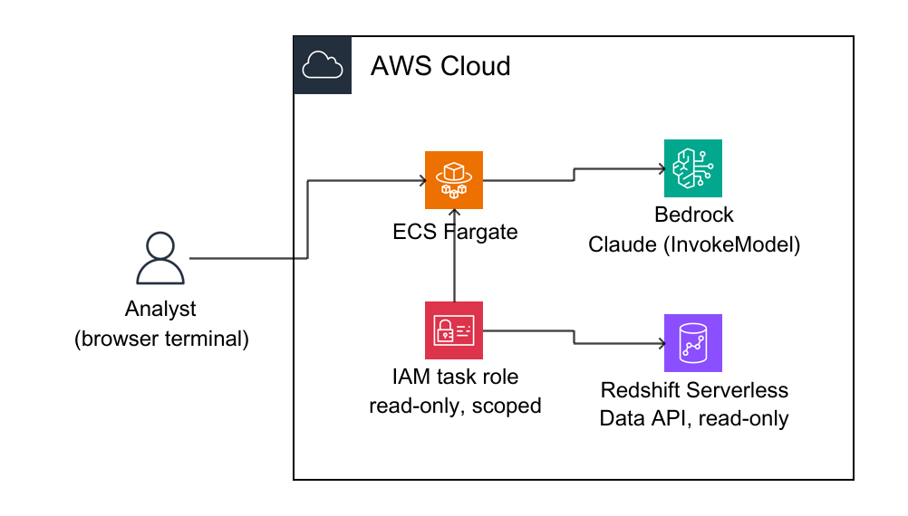

# Chapter code

The runnable code for *Developing AI/ML Solutions on AWS*, one folder per chapter.
Every chapter runs **locally first** — real engines in containers standing in for
the AWS services — then on **real AWS** with the same code; only the endpoints
change. Each chapter's `diagrams/` holds the cloud architecture and its local
mirror, and `make diagrams` regenerates them from `diagrams/yaml/`.

Below: what each chapter builds, the AWS services it uses, and the local stand-in
for each.

---

## Chapter 01 — Data engineering

The credit-bureau data lake and feature store: an ELT that lands raw files in S3,
loads a Redshift warehouse with dlt, builds dbt marts, and ships features to an
offline (Iceberg) and online (DynamoDB) store.



- **AWS services:** Amazon S3, S3 Tables, AWS Glue, Amazon Redshift Serverless,
  Amazon Athena, Amazon EventBridge, SageMaker Feature Store, Amazon DynamoDB,
  Airflow on EC2
- **Local stand-ins:** MinIO (S3), Iceberg REST catalog (Glue Data Catalog), Trino
  (Athena), redshift-local (Redshift), DynamoDB Local (Feature Store online),
  Glue + dlt

## Chapter 02 — MLOps

A champion/challenger scorecard trained on SageMaker, tracked in MLflow and tuned
with AMT, then served three ways — endpoint, Lambda, and Fargate — from one image.



- **AWS services:** Amazon SageMaker AI (training, endpoints, Pipelines, MLflow,
  AMT), Amazon ECR, AWS CodeBuild, AWS Deep Learning Containers, AWS Lambda, AWS
  Fargate, Amazon API Gateway
- **Local stand-ins:** custom containers (docker run), serverless MLflow (sqlite +
  registry), S3Proxy (S3), Lambda RIE, Fargate via Docker Compose

## Chapter 03 — Generative AI

A grounded underwriting assistant on Bedrock: retrieval over pgvector, guardrails
on the answer path, and a Strands agent — the whole loop runnable offline.



- **AWS services:** Amazon Bedrock (Converse, embeddings, Guardrails, AgentCore),
  Amazon RDS for PostgreSQL + pgvector, AWS Lambda, Amazon API Gateway, AWS Secrets
  Manager
- **Local stand-ins:** Ollama (Bedrock), pgvector Postgres (RDS), Strands agent
  (`BEDROCK_LOCAL=1`)

## Chapter 04 — Realtime scoring

The decision service: a scoring container behind an Application Load Balancer on
ECS Fargate, logging every decision to DynamoDB. The image is built in the cloud
by CodeBuild — the laptop never builds it.



- **AWS services:** Amazon ECS on AWS Fargate, Application Load Balancer, Amazon
  DynamoDB, AWS CodeBuild, Amazon ECR, Amazon S3, Amazon VPC
- **Local stand-ins:** the service container + DynamoDB Local (Docker Compose)

## Chapter 05 — Batch limits

The monthly batch run: an EventBridge schedule starts a SageMaker pipeline that
recomputes credit limits against the Redshift warehouse, stages results in S3, and
alerts an SNS topic on failure.



- **AWS services:** Amazon EventBridge (schedule), SageMaker Pipelines, AWS
  CodeBuild, Amazon ECR, Amazon S3, Amazon Redshift (warehouse from ch-01), Amazon
  SNS
- **Local stand-ins:** redshift-local (Redshift), S3Proxy (S3), step container
  (Docker Compose)

## Chapter 06 — Streaming fraud

Real-time fraud scoring on a transaction stream: records land on Kinesis, a
scoring function flags them, results are archived through Firehose and logged to
DynamoDB, with the credit warehouse alongside for enrichment.



- **AWS services:** Amazon Kinesis Data Streams, Amazon Data Firehose, AWS Lambda,
  Amazon DynamoDB, Amazon Redshift Serverless, Amazon S3, AWS CodeBuild, Amazon ECR
- **Local stand-ins:** kinesis-local (Kinesis), a from-source Firehose, DynamoDB
  Local, S3Proxy (S3), redshift-local (Redshift)

## Chapter 07 — Vision RAG

KYC face verification as vector search: a face embedder turns an ID and a selfie
into vectors, pgvector finds the nearest enrolled identity, and the match is
verified against the claimed subject — the whole loop behind an HTTP API.



- **AWS services:** Amazon RDS for PostgreSQL + pgvector, AWS Lambda, Amazon API
  Gateway (HTTP API), Amazon S3, AWS CodeBuild, Amazon ECR
- **Local stand-ins:** pgvector Postgres (RDS); the face embedder/explainer run
  directly

## Chapter 08 — Self-service analytics

Analysts ask questions in plain English; Claude Code on Bedrock writes read-only
SQL, runs it through the Redshift Data API under a scoped task role, and answers
with a table, a summary, and the tables it touched — the terminal in the browser.



- **AWS services:** Amazon Bedrock, Amazon Redshift Serverless (Data API), Amazon
  ECS Fargate, Amazon ECR, AWS CodeBuild, Amazon CloudWatch Logs
- **Local stand-ins:** redshift-local + a from-source Data API shim (Redshift),
  Docker Compose (Fargate), Ollama / vllm-metal (Bedrock)

## Chapter 09 — Underwriting knowledge base

*Scaffold in progress.* Policy documents, credit reports, and synthetic dossier
memos embedded with Bedrock and stored in Aurora pgvector and S3 Vectors,
answered with citations, with an agent that assembles similar past cases into a
recommendation the underwriter signs off on.

- **AWS services:** Amazon Bedrock (embeddings, Converse), Amazon Aurora
  PostgreSQL + pgvector, Amazon S3 Vectors, Amazon OpenSearch Service, AWS Lambda,
  Amazon API Gateway
- **Local stand-ins:** Ollama (Bedrock), pgvector Postgres (Aurora), OpenSearch in
  a container

## Chapter 10 — Conversation classification

*Scaffold in progress.* A Strands and Bedrock agent files each customer
conversation into a category with zero-shot classification and routes it through
SNS, batched over a JSONL manifest, with a labeled set keeping accuracy honest.

- **AWS services:** Amazon Bedrock (batch inference, Converse), Amazon SNS, Amazon S3
- **Local stand-ins:** Ollama (Bedrock), an SNS shim composed from source, a local
  batch-inference runner

## Chapter 11 — Monitoring

*Scaffold in progress.* Online PSI monitoring of scores and features, SHAP-based
drift in a CatBoost scorecard's feature contributions, SageMaker Model Monitor
and Clarify for data and concept drift, and CloudWatch alerting.

- **AWS services:** Amazon SageMaker Model Monitor, SageMaker Clarify, Amazon
  CloudWatch
- **Local stand-ins:** SageMaker Monitor/Clarify and CloudWatch shims composed from
  source; SHAP + CatBoost run directly

## Chapter 12 — Governance

*Scaffold in progress.* Model cards, the model registry, and lineage for
auditors; least-privilege IAM; and a new model shipped with champion/challenger
rollout and an A/B test, flipped through AppConfig feature flags with no redeploy.

- **AWS services:** Amazon SageMaker Model Cards, SageMaker Model Registry,
  SageMaker ML Lineage, AWS AppConfig, AWS IAM
- **Local stand-ins:** an AppConfig flag store + rule evaluator composed from
  source (ION-format configuration)

---

## Per-chapter deploy identities

Each chapter deploys with its **own** scoped IAM role — `ch01-user` … `ch08-user` —
carrying only that chapter's permissions, instead of running everything as admin.
Piling every chapter's permissions onto one admin user hits the IAM per-user policy
quota (the "runs out of permissions" failure); one assumable role per chapter avoids
that and keeps each chapter least-privilege. Each role's permissions live in that
chapter's `aws/iam/deploy.json`.

**Provision it per chapter, when you reach that chapter's cloud work — not the
whole book up front.** Each chapter's `aws/Makefile` has an `iam` target; from a
privileged identity (one that can create roles):

```bash
make -C code/ch-04-realtime-scoring/aws iam    # creates ch04-user from its deploy.json
```

`make iam` creates `chNN-user` trusting you to `sts:AssumeRole` and attaches that
chapter's `deploy.json` inline. Re-run it after editing the policy. (ch-08 has no
`aws/Makefile`, so its target is `make -C
code/ch-08-selfservice-analytics iam`.)

Then add a profile for the chapter to `~/.aws/config` and deploy under it:

```ini
[profile ch04]
role_arn = arn:aws:iam::<ACCOUNT_ID>:role/ch04-user
source_profile = default
region = us-east-1
```

```bash
make -C code/ch-04-realtime-scoring deploy AWS_PROFILE=ch04
```

**These policies are best-effort and must be author-tested.** Each `deploy.json`
was derived from the chapter's `aws/` and Make targets. Least-privilege is
iterative: run the chapter as `chNN-user`, and if a call returns `AccessDenied`,
add that one action to the chapter's `deploy.json` and re-run `make iam`. A few
statements stay broad (`ec2:*Vpc*`, `glue:*`, `sagemaker:*`) where tight ARN
scoping isn't practical.
